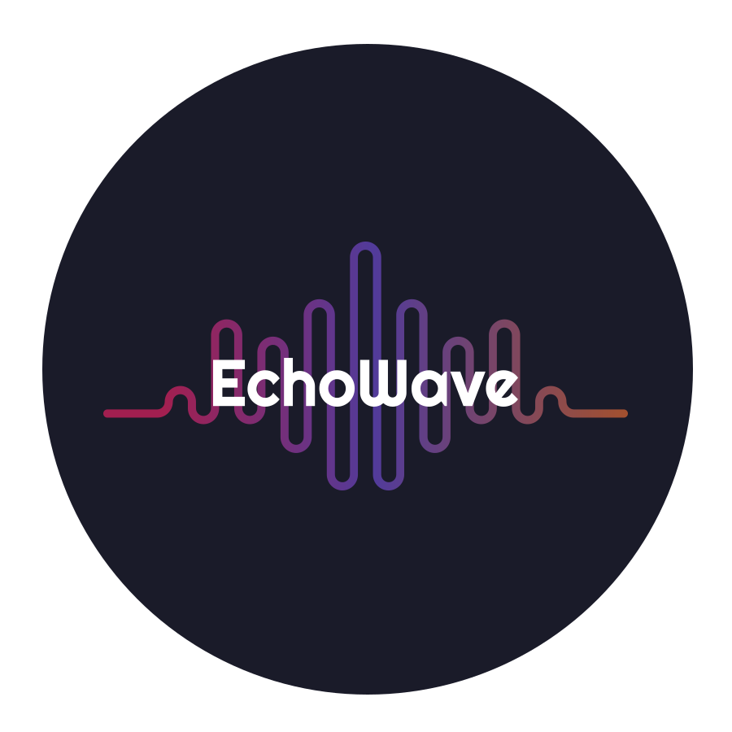
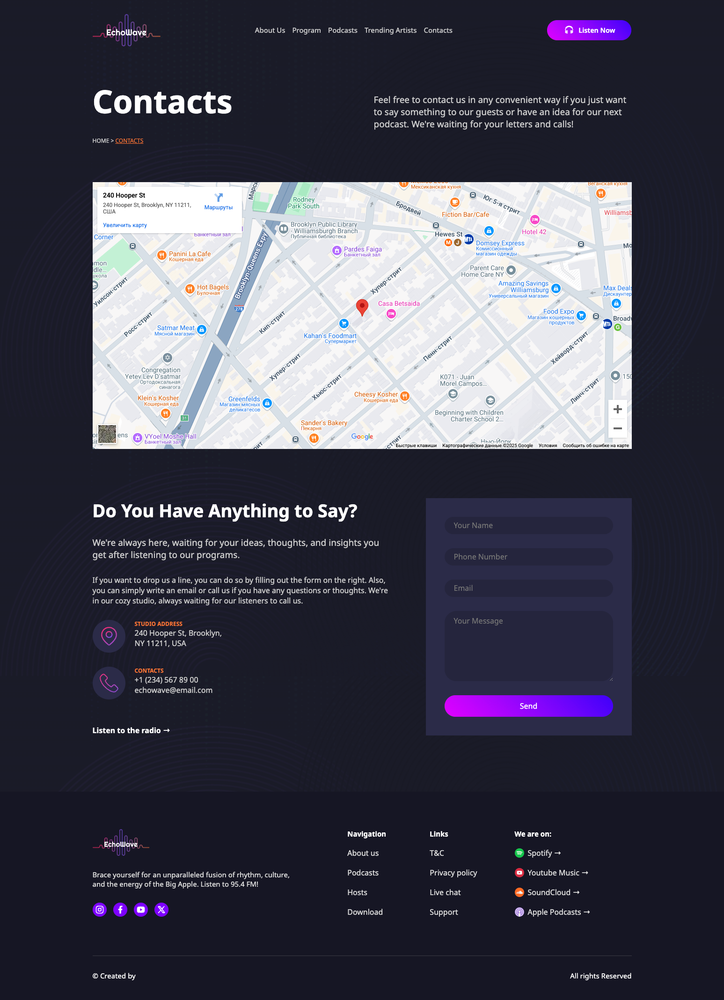
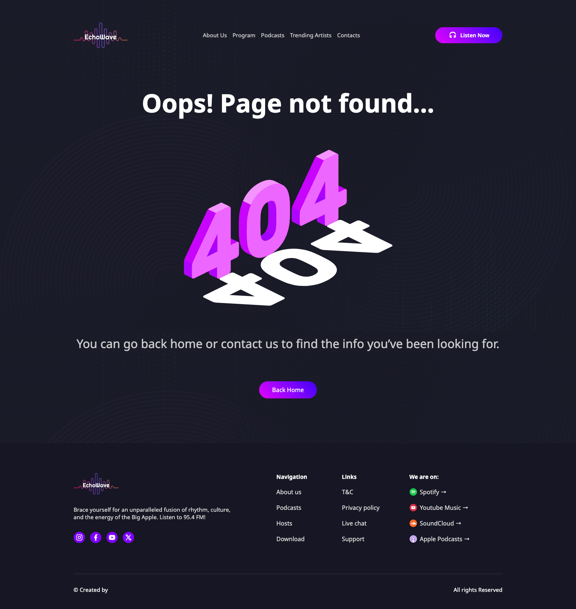
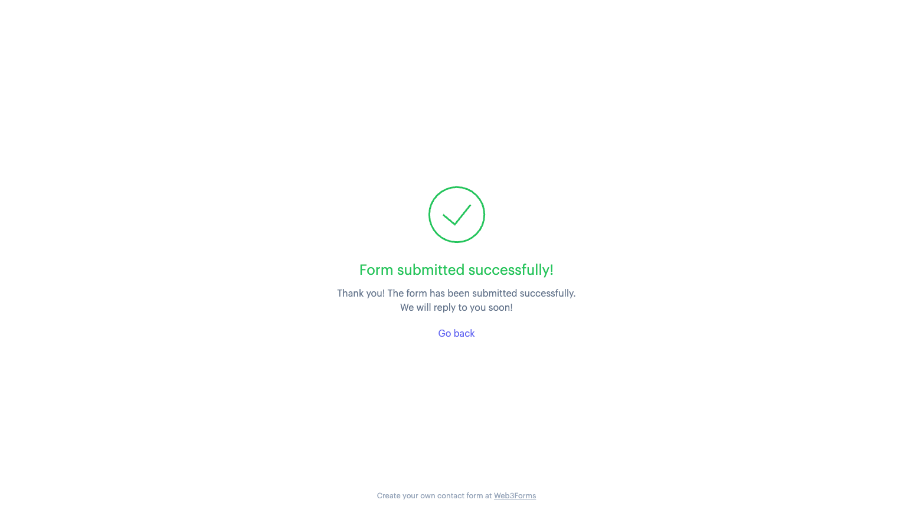

<div align="center">
  <a href="https://koldovsky.github.io/1329-team-02/">
    
  </a>
  <h3 align="center">EchoWave - Team Project</h3>
</div>

## 📌 Project Overview

The EchoWave website demonstrates our team's ability to design and develop a
static, visually appealing, and responsive web interface.<br>This project was
built collaboratively by our team using only <strong>HTML</strong>,
<strong>CSS</strong>, and <strong>JavaScript</strong>.

## 🔗 Project Link

Check out the live version of the project here:
<a href="https://koldovsky.github.io/1329-team-02/" target="_blank"> 🖇️ EchoWave
Website</a>

## Development team :

| Name                  | Role                    | GitHub                                                                                                                                          | Tech Stack                                                                                                                                                                                                                                                             |
| --------------------- | ----------------------- | ----------------------------------------------------------------------------------------------------------------------------------------------- | ---------------------------------------------------------------------------------------------------------------------------------------------------------------------------------------------------------------------------------------------------------------------- |
| Yevhen Martynych      | **Team Lead**           | [](https://github.com/yevhenmartynych)     | [](#) [](#) [](#) |
| Viktor Svertoka       | **Deputy Team Lead**    | [](https://github.com/ViktorSvertoka)      | [](#) [](#) [](#) |
| Markiian Senkiv       | **Front End Developer** | [](https://github.com/MarkiianSenkiv)      | [](#) [](#) [](#) |
| Oleksandr Kopytin     | **Front End Developer** | [](https://github.com/prohodec)            | [](#) [](#) [](#) |
| Dmytro Prokopenko     | **Front End Developer** | [](https://github.com/micromoleckula)      | [](#) [](#) [](#) |
| Yuliia Shpylka        | **Front End Developer** | [](https://github.com/yuliiashpylkatestqa) | [](#) [](#) [](#) |
| Vladimir Kravets      | **Front End Developer** | [](https://github.com/KravetsVA)           | [](#) [](#) [](#) |
| Vladyslav Plakhotniuk | **Front End Developer** | [](https://github.com/hola2005)            | [](#) [](#) [](#) |
| Anhelina Lytovchenko  | **Front End Developer** | [](https://github.com/Lytovchenkoo)        | [](#) [](#) [](#) |
| Roman Lytvynenko      | **Front End Developer** | [](https://github.com/rlnolino)            | [](#) [](#) [](#) |

### Results of the completed task:

#### Page Home


#### Page About Us


#### Page Podcasts


#### Page Contacts



#### Page 404



#### Sending form to email



<!-- # HTML Template Repository with HTML Proofer

This template repository includes preconfigured GitHub Action that will validate
html files in a project with
(HTMLProofer)[https://github.com/gjtorikian/html-proofer/]. And htmx to load
partials

```html
<main
  data-hx-trigger="load"
  data-hx-swap="outerHTML"
  data-hx-get="index.main.partial.html"
></main>
```

```js
function init() {
  import('...js');
}

const totalPartials = document.querySelectorAll(
  '[hx-trigger="load"], [data-hx-trigger="load"]'
).length;
let loadedPartialsCount = 0;

document.body.addEventListener('htmx:afterOnLoad', () => {
  loadedPartialsCount++;
  if (loadedPartialsCount === totalPartials) init();
});
```

Add the data-proofer-ignore attribute to any tag to ignore it from every check.

```html
<a href="https://notareallink" data-proofer-ignore>Not checked.</a>
``` -->
